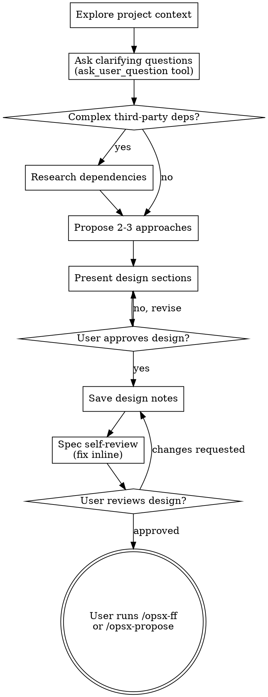

# Brainstorming → OpenSpec (Pi)

Help turn ideas into fully formed designs through structured questioning using the `ask_user_question` tool, then hand off to OpenSpec for spec/plan management.

**Requires:** `@juicesharp/rpiv-ask-user-question` installed (`pi install npm:@juicesharp/rpiv-ask-user-question`). If not available, fall back to asking questions manually one at a time.

**Prerequisite:** [OpenSpec CLI](https://openspec.dev) installed and initialized in the project (`openspec init`).

Start by understanding the current project context, then use `ask_user_question` to present structured clarifying questions. Once you understand what you're building, present the design and get user approval.

<HARD-GATE>
Do NOT invoke any implementation skill, write any code, scaffold any project, or take any implementation action until you have presented a design and the user has approved it. This applies to EVERY project regardless of perceived simplicity.
</HARD-GATE>

## Anti-Pattern: "This Is Too Simple To Need A Design"

Every project goes through this process. A todo list, a single-function utility, a config change — all of them. "Simple" projects are where unexamined assumptions cause the most wasted work. The design can be short (a few sentences for truly simple projects), but you MUST present it and get approval.

## Checklist

You MUST create a task for each of these items and complete them in order:

1. **Explore project context** — check files, docs, recent commits, existing openspec specs
2. **Offer visual companion** (if topic will involve visual questions) — its own message
3. **Ask clarifying questions** — use `ask_user_question` tool (see below)
4. **Research third-party dependencies** — if the design involves complex external libraries (payment SDKs, cloud APIs, auth providers, etc.), launch a sub-agent to investigate before proposing approaches. See section below.
5. **Propose 2-3 approaches** — with trade-offs and your recommendation
6. **Present design** — in sections scaled to their complexity
7. **Save design notes** to `docs/superpowers/specs/YYYY-MM-DD-<topic>-design.md` and commit
8. **Spec self-review** — check for placeholders, contradictions, ambiguity
9. **User reviews written design** — ask user to review before proceeding
10. **Transition to OpenSpec** — instruct user to create OpenSpec change

## Asking Questions with `ask_user_question`

Instead of asking questions one at a time manually, use the `ask_user_question` tool to present structured questions.

**When to use it:**
- During clarifying questions phase (step 3)
- When proposing approaches (step 4)
- When presenting design choices with clear alternatives

**How to structure questions:**

```typescript
ask_user_question({
  questions: [
    {
      header: "Purpose",
      question: "What is the main goal of this feature?",
      options: [
        { label: "New feature", description: "Build something from scratch" },
        { label: "Refactor", description: "Improve existing code" },
        { label: "Migration", description: "Move between systems" }
      ]
    },
    {
      header: "Scope",
      question: "What does this change affect?",
      multiSelect: true,
      options: [
        { label: "Frontend", description: "UI changes only" },
        { label: "Backend", description: "API and data layer" },
        { label: "Infra", description: "Deploy and config" }
      ]
    }
  ]
})
```

**Guidelines:**
- Group related questions together (2-4 per call)
- Use `multiSelect: true` when multiple answers are valid
- Use `preview` for side-by-side views of code or config examples
- Keep `header` under 16 chars, `label` under 60 chars
- If the user selects "Chat about this", engage in free-form dialogue

**Field names — these are strict:**
- Each question MUST have `header` (NOT `title`)
- Each option MUST have `label` AND `description`
- Do not invent extra fields — the schema only accepts: `question`, `header`, `options[].label`, `options[].description`, `options[].preview`, `multiSelect`

**When NOT to use `ask_user_question`:**
- Exploring open-ended topics (use free-form dialogue)
- When you don't have enough context for meaningful options
- If the tool is not available — fall back to manual questions

## Process Flow



**The terminal state is the user running `/opsx-ff <change-name>` or `/opsx-propose <change-name>`.**

## The Process

**Understanding the idea:**

- Check out the current project state first (files, docs, recent commits, existing openspec specs)
- Before asking detailed questions, assess scope
- For appropriately-scoped projects, use `ask_user_question` to refine the idea
- Focus on understanding: purpose, constraints, success criteria

**Research third-party dependencies:**

- If the design involves complex external libraries (payment SDKs like Stripe, cloud APIs, auth providers, etc.), research them before proposing approaches
- Launch a sub-agent to investigate using `context7`, official docs, or web search
- Focus on: setup requirements, API surface, auth patterns, error handling, webhooks/callbacks, rate limits, official SDK patterns
- Collect findings into a structured summary to reference when proposing approaches and in the design
- For simple/well-known libraries (formatting, utility helpers), skip this step

**Exploring approaches:**

- Propose 2-3 different approaches with trade-offs
- Lead with your recommended option and explain why
- Use `ask_user_question` to let the user compare approaches

**Presenting the design:**

- Scale each section to its complexity
- Cover: architecture, components, data flow, error handling, testing

## After the Design

Same as standard brainstorming-openspec: save design notes, self-review, user reviews, transition to OpenSpec.

## Key Principles

- **Use `ask_user_question`** for structured questions
- **Group related questions** — 2-4 per call
- **YAGNI ruthlessly** — Remove unnecessary features
- **Research before proposing** — When complex third-party dependencies are involved, investigate before designing architecture
- **Explore alternatives** — Always propose 2-3 approaches
- **Incremental validation** — Present design, get approval before moving on

## Visual Companion

See the standard brainstorming skill for Visual Companion details.
