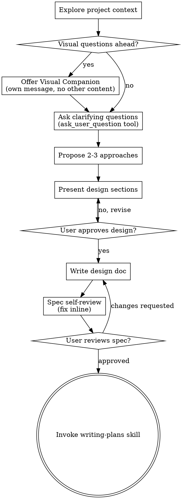

# Brainstorming Ideas Into Designs (Pi)

Help turn ideas into fully formed designs and specs through structured questioning using the `ask_user_question` tool.

**Requires:** `@juicesharp/rpiv-ask-user-question` installed (`pi install npm:@juicesharp/rpiv-ask-user-question`). If not available, fall back to asking questions manually one at a time.

Start by understanding the current project context, then use `ask_user_question` to present structured clarifying questions. Once you understand what you're building, present the design and get user approval.

<HARD-GATE>
Do NOT invoke any implementation skill, write any code, scaffold any project, or take any implementation action until you have presented a design and the user has approved it. This applies to EVERY project regardless of perceived simplicity.
</HARD-GATE>

## Anti-Pattern: "This Is Too Simple To Need A Design"

Every project goes through this process. A todo list, a single-function utility, a config change — all of them. "Simple" projects are where unexamined assumptions cause the most wasted work. The design can be short (a few sentences for truly simple projects), but you MUST present it and get approval.

## Checklist

You MUST create a task for each of these items and complete them in order:

1. **Explore project context** — check files, docs, recent commits
2. **Offer visual companion** (if topic will involve visual questions) — its own message
3. **Ask clarifying questions** — use `ask_user_question` tool (see below)
4. **Propose 2-3 approaches** — with trade-offs and your recommendation
5. **Present design** — in sections scaled to their complexity, get user approval after each section
6. **Write design doc** — save to `docs/superpowers/specs/YYYY-MM-DD-<topic>-design.md` and commit
7. **Spec self-review** — quick inline check for placeholders, contradictions, ambiguity, scope
8. **User reviews written spec** — ask user to review the spec file before proceeding
9. **Transition to implementation** — invoke writing-plans skill to create implementation plan

## Asking Questions with `ask_user_question`

Instead of asking questions one at a time manually, use the `ask_user_question` tool to present structured questions. This lets the user see all options at once, compare them side-by-side, and submit answers in one go.

**When to use it:**
- During clarifying questions phase (step 3)
- When proposing approaches (step 4) — show the trade-offs as structured options
- When presenting design choices that have clear alternatives

**How to structure questions:**

```typescript
ask_user_question({
  questions: [
    {
      header: "Purpose",     // max 16 chars
      question: "What is the main goal of this feature?",
      options: [
        { label: "New feature", description: "Build something from scratch" },
        { label: "Refactor", description: "Improve existing code without changing behavior" },
        { label: "Migration", description: "Move from one system/service to another" }
      ]
    },
    {
      header: "Platform",
      question: "Which platforms should this support?",
      multiSelect: true,  // allow multiple selections
      options: [
        { label: "Web", description: "Browser-based interface" },
        { label: "CLI", description: "Command-line tool" },
        { label: "API", description: "REST/GraphQL endpoints only" }
      ]
    }
  ]
})
```

**Guidelines:**
- Group related questions together (2-4 per call) — don't put everything in one huge dialog
- Use `multiSelect: true` when multiple answers are valid (e.g., platforms, tech choices)
- Use `preview` (markdown string) on options that benefit from a side-by-side view: code snippets, configs, mockups, diagrams
- Keep `header` under 16 chars — it's a chip/tab label
- Keep `label` under 60 chars — 1-5 words is ideal
- Use `description` to explain the trade-off or what the choice means
- If the user selects "Chat about this", engage in free-form dialogue to clarify

**Field names — these are strict:**
- Each question MUST have `header` (NOT `title`)
- Each option MUST have `label` AND `description`
- Do not invent extra fields — the schema only accepts: `question`, `header`, `options[].label`, `options[].description`, `options[].preview`, `multiSelect`

**When NOT to use `ask_user_question`:**
- When you need to explore open-ended topics (use free-form questions instead)
- When you don't yet have enough context to propose meaningful options
- If the tool is not available (not installed) — fall back to asking one at a time manually

## Process Flow



**The terminal state is invoking writing-plans.** Do NOT invoke frontend-design, mcp-builder, or any other implementation skill. The ONLY skill you invoke after brainstorming is writing-plans.

## The Process

**Understanding the idea:**

- Check out the current project state first (files, docs, recent commits)
- Before asking detailed questions, assess scope: if the request describes multiple independent subsystems, flag this immediately
- If the project is too large for a single spec, help the user decompose into sub-projects
- For appropriately-scoped projects, use `ask_user_question` to refine the idea
- Focus on understanding: purpose, constraints, success criteria

**Exploring approaches:**

- Propose 2-3 different approaches with trade-offs
- Present options conversationally with your recommendation and reasoning
- You can use `ask_user_question` here too to let the user compare approaches

**Presenting the design:**

- Once you believe you understand what you're building, present the design
- Scale each section to its complexity
- Cover: architecture, components, data flow, error handling, testing
- Be ready to go back and clarify if something doesn't make sense

## After the Design

Same as standard brainstorming: write design doc, self-review, user reviews, invoke writing-plans.

## Key Principles

- **Use `ask_user_question`** for structured questions — faster and clearer for the user
- **Group related questions** — 2-4 per call, don't overwhelm
- **YAGNI ruthlessly** — Remove unnecessary features from all designs
- **Explore alternatives** — Always propose 2-3 approaches before settling
- **Incremental validation** — Present design, get approval before moving on

## Visual Companion

See the standard brainstorming skill for Visual Companion details.
