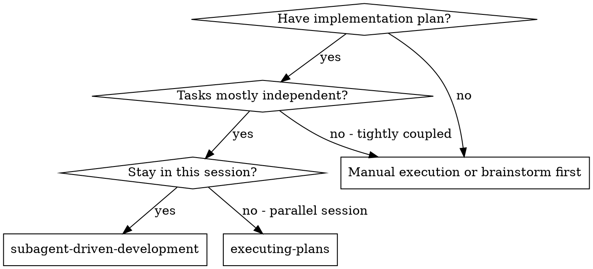
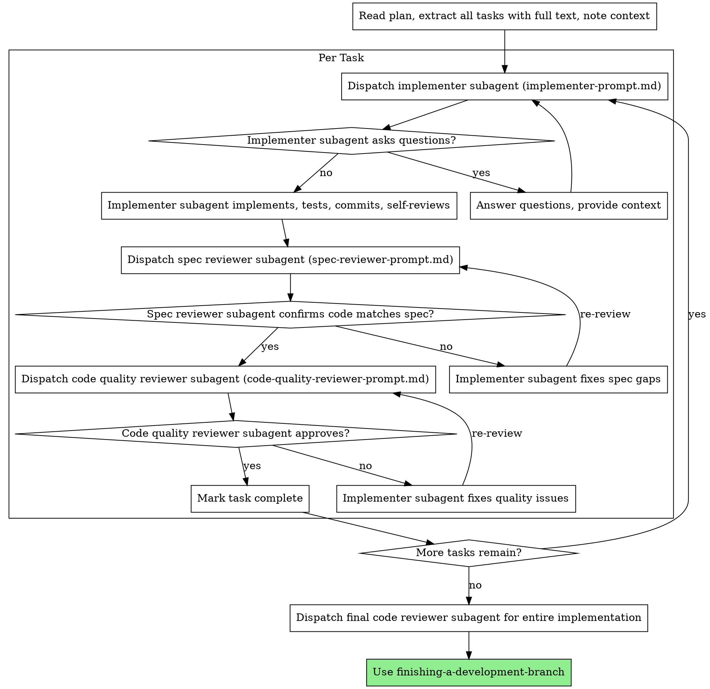

# Subagent-Driven Development

Execute plan by dispatching fresh subagent per task, with two-stage review after each: spec compliance review first, then code quality review.

**Why subagents:** You delegate tasks to specialized agents with isolated context. By precisely crafting their instructions and context, you ensure they stay focused and succeed at their task. They should never inherit your session's context or history — you construct exactly what they need. This also preserves your own context for coordination work.

**Core principle:** Fresh subagent per task + two-stage review (spec then quality) = high quality, fast iteration

## When to Use



**vs. Executing Plans (parallel session):**
- Same session (no context switch)
- Fresh subagent per task (no context pollution)
- Two-stage review after each task: spec compliance first, then code quality
- Faster iteration (no human-in-loop between tasks)

## The Process



## Model Selection

Use the least powerful model that can handle each role to conserve cost and increase speed.

**Mechanical implementation tasks** (isolated functions, clear specs, 1-2 files): use a fast, cheap model. Most implementation tasks are mechanical when the plan is well-specified.

**Integration and judgment tasks** (multi-file coordination, pattern matching, debugging): use a standard model.

**Architecture, design, and review tasks**: use the most capable available model.

**Task complexity signals:**
- Touches 1-2 files with a complete spec → cheap model
- Touches multiple files with integration concerns → standard model
- Requires design judgment or broad codebase understanding → most capable model

## Handling Implementer Status

Implementer subagents report one of four statuses. Handle each appropriately:

**DONE:** Proceed to spec compliance review.

**DONE_WITH_CONCERNS:** The implementer completed the work but flagged doubts. Read the concerns before proceeding. If the concerns are about correctness or scope, address them before review. If they're observations (e.g., "this file is getting large"), note them and proceed to review.

**NEEDS_CONTEXT:** The implementer needs information that wasn't provided. Provide the missing context and re-dispatch.

**BLOCKED:** The implementer cannot complete the task. Assess the blocker:
1. If it's a context problem, provide more context and re-dispatch with the same model
2. If the task requires more reasoning, re-dispatch with a more capable model
3. If the task is too large, break it into smaller pieces
4. If the plan itself is wrong, escalate to the human

**Never** ignore an escalation or force the same model to retry without changes. If the implementer said it's stuck, something needs to change.

## Dispatch: Pi Subagent Syntax

In Pi, dispatch subagents using the `subagent` tool. Read the prompt templates first, fill in the placeholders, and pass them as the task.

### Implementer dispatch

Read `implementer-prompt.md`, fill in the task description, context, and placeholders, then dispatch:

```typescript
subagent({
  agent: "superpowers.implementer",
  task: `You are implementing Task N: [task name]

## Task Description

[FULL TEXT of task from plan]

## Context

[Scene-setting context]

## Your Job

Once you're clear on requirements:
1. Implement exactly what the task specifies
2. Write tests (following TDD if task says to)
3. Verify implementation works
4. Commit your work
5. Self-review
6. Report back`,
  context: "fresh"
})
```

### Spec reviewer dispatch

Use `scout` (fast/cheap) for spec compliance — just read the code and compare:

```typescript
subagent({
  agent: "superpowers.spec-reviewer",
  task: `You are reviewing whether an implementation matches its specification.

## What Was Requested

[FULL TEXT of task requirements]

## What Implementer Claims They Built

[From implementer's report]

...rest of spec-reviewer-prompt.md content...`,
  context: "fresh"
})
```

### Code quality reviewer dispatch

```typescript
subagent({
  agent: "superpowers.code-reviewer",
  task: `Review the implementation for code quality concerns.

What was implemented: [from implementer's report]
Plan/requirements: Task N from [plan-file]
Base SHA: [commit before task]
Head SHA: [current commit]
Description: [task summary]

...rest of code-quality-reviewer-prompt.md content...`,
  context: "fresh"
})
```

## Example Workflow

```
You: I'm using Subagent-Driven Development to execute this plan.

[Read plan file once: docs/superpowers/plans/feature-plan.md]
[Extract all 5 tasks with full text and context]

Task 1: Hook installation script

[Read implementer-prompt.md, fill template]
[Dispatch implementer subagent]

subagent({
  agent: "superpowers.implementer",
  task: "You are implementing Task 1: Hook installation script...",
  context: "fresh"
})

Implementer: "Before I begin - should the hook be installed at user or system level?"

You: "User level (~/.config/superpowers/hooks/)"

Implementer: "Got it. Implementing now..."
[Later] Implementer:
  - Implemented install-hook command
  - Added tests, 5/5 passing
  - Self-review: Found I missed --force flag, added it
  - Committed

[Dispatch spec reviewer]

subagent({
  agent: "superpowers.spec-reviewer",
  task: "You are reviewing whether an implementation matches its specification...",
  context: "fresh"
})

Spec reviewer: ✅ Spec compliant - all requirements met, nothing extra

[Dispatch code quality reviewer]

subagent({
  agent: "superpowers.code-reviewer",
  task: "Review code quality. What was implemented: ...",
  context: "fresh"
})

Code reviewer: Strengths: Good test coverage, clean. Issues: None. Approved.

[Task 1 complete. Continue with next task.]
```

## Advantages

**vs. Manual execution:**
- Subagents follow TDD naturally
- Fresh context per task (no confusion)
- Parallel-safe (subagents don't interfere)
- Subagent can ask questions (before AND during work)

**vs. Executing Plans:**
- Same session (no handoff)
- Continuous progress (no waiting)
- Review checkpoints automatic

**Efficiency gains:**
- No file reading overhead (controller provides full text)
- Controller curates exactly what context is needed
- Subagent gets complete information upfront
- Questions surfaced before work begins (not after)

**Quality gates:**
- Self-review catches issues before handoff
- Two-stage review: spec compliance, then code quality
- Review loops ensure fixes actually work
- Spec compliance prevents over/under-building
- Code quality ensures implementation is well-built

**Cost:**
- More subagent invocations (implementer + 2 reviewers per task)
- Controller does more prep work (extracting all tasks upfront)
- Review loops add iterations
- But catches issues early (cheaper than debugging later)

## Parallel Execution

By default, tasks run **sequentially** — one implementer at a time, with full two-stage review before moving to the next task. This is the safe path and should remain the norm.

You may run tasks in **parallel** only when ALL of the following are true:

1. **The plan explicitly marks them as parallel** — each task has `**Parallel:** yes (with Task X)`
2. **No shared files** — tasks read/write completely disjoint sets of files
3. **No shared integration points** — tasks do not wire into the same module, API, or component
4. **No shared state** — tasks do not depend on each other's side effects
5. **Clear, unambiguous scope** — each task's boundaries are well understood
6. **Low concurrency** — at most 2-3 tasks in parallel, not open-ended

### How to execute parallel tasks

When the plan marks tasks as parallel-safe:

1. Read the full plan and identify all parallel groups
2. For each parallel group, dispatch one implementer subagent per task **simultaneously** using `subagent({ tasks: [...], concurrency: N })`
3. Each implementer works in isolation with its own fresh context
4. Wait for ALL implementers in the group to complete
5. Run spec compliance review on each result sequentially (do not parallelize reviews)
6. Run code quality review on each result sequentially
7. Only after ALL reviews pass, mark the parallel group complete and move on

### What stays sequential

- Tasks NOT marked as parallel in the plan
- Any task that touches files another task touches
- Review loops (spec compliance → code quality) must always be sequential per task
- The first task in a plan that sets up shared contracts or infrastructure

## Red Flags

**Never:**
- Start implementation on main/master branch without explicit user consent
- Skip reviews (spec compliance OR code quality)
- Proceed with unfixed issues
- Dispatch multiple implementation subagents in parallel **unless the plan explicitly marks them as independent AND they meet all parallel safety criteria** (see Parallel Execution section above)
- Make subagent read plan file (provide full text instead)
- Skip scene-setting context (subagent needs to understand where task fits)
- Ignore subagent questions (answer before letting them proceed)
- Accept "close enough" on spec compliance (spec reviewer found issues = not done)
- Skip review loops (reviewer found issues = implementer fixes = review again)
- Let implementer self-review replace actual review (both are needed)
- **Start code quality review before spec compliance is ✅** (wrong order)
- Move to next task while either review has open issues

**If subagent asks questions:**
- Answer clearly and completely
- Provide additional context if needed
- Don't rush them into implementation

**If reviewer finds issues:**
- Implementer (same subagent) fixes them
- Reviewer reviews again
- Repeat until approved
- Don't skip the re-review

**If subagent fails task:**
- Dispatch fix subagent with specific instructions
- Don't try to fix manually (context pollution)

## Integration

**Required workflow skills:**
- **using-git-worktrees** - REQUIRED: Set up isolated workspace before starting
- **writing-plans** - Creates the plan this skill executes
- **requesting-code-review** - Code review template for reviewer subagents
- **finishing-a-development-branch** - Complete development after all tasks

**Subagents should use:**
- **test-driven-development** - Subagents follow TDD for each task

**Alternative workflow:**
- **executing-plans** - Use for parallel session instead of same-session execution

## Prompt Templates

- `implementer-prompt.md` — Dispatch implementer subagent (read it, fill placeholders, pass as task)
- `spec-reviewer-prompt.md` — Dispatch spec compliance reviewer subagent
- `code-quality-reviewer-prompt.md` — Dispatch code quality reviewer subagent

Read the template files from `skills/subagent-driven-development/` and include their filled content as the subagent's task parameter. The templates use the same format as the original — just read them instead of using a "Task tool".
