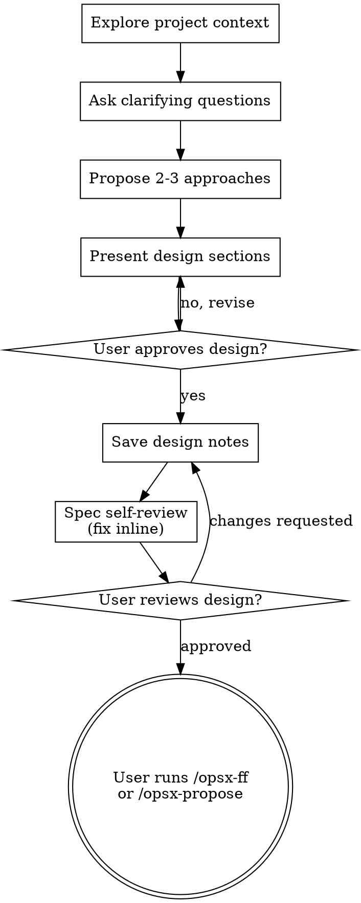

# Brainstorming → OpenSpec

Help turn ideas into fully formed designs through natural collaborative dialogue, then hand off to OpenSpec for spec/plan management.

Start by understanding the current project context, then ask questions one at a time to refine the idea (use the `question` tool for multiple-choice questions). Once you understand what you're building, present the design and get user approval.

<HARD-GATE>
Do NOT invoke any implementation skill, write any code, scaffold any project, or take any implementation action until you have presented a design and the user has approved it. This applies to EVERY project regardless of perceived simplicity.
</HARD-GATE>

**Prerequisite:** [OpenSpec CLI](https://openspec.dev) installed and initialized in the project (`openspec init`).

## Anti-Pattern: "This Is Too Simple To Need A Design"

Every project goes through this process. A todo list, a single-function utility, a config change — all of them. "Simple" projects are where unexamined assumptions cause the most wasted work. The design can be short (a few sentences for truly simple projects), but you MUST present it and get approval.

## Checklist

You MUST create a task for each of these items and complete them in order:

1. **Explore project context** — check files, docs, recent commits, existing openspec specs
2. **Offer visual companion** (if topic will involve visual questions) — its own message
3. **Ask clarifying questions** — one at a time (use the `question` tool with predefined options when possible)
4. **Propose 2-3 approaches** — with trade-offs and your recommendation
5. **Present design** — in sections scaled to their complexity
6. **Save design notes** to `docs/superpowers/specs/YYYY-MM-DD-<topic>-design.md` and commit
7. **Spec self-review** — check for placeholders, contradictions, ambiguity
8. **User reviews written design** — ask user to review before proceeding
9. **Transition to OpenSpec** — instruct user to create OpenSpec change

## Process Flow

**The terminal state is the user running `/opsx-ff <change-name>` or `/opsx-propose <change-name>`.** Do NOT invoke writing-plans or any other superpowers skill after this.

## The Process

**Understanding the idea:**

- Check out the current project state first (files, docs, recent commits, existing openspec specs)
- Before asking detailed questions, assess scope: if the request describes multiple independent subsystems, flag this immediately
- If the project is too large for a single spec, help decompose into sub-projects
- For appropriately-scoped projects, ask questions one at a time
- Use the `question` tool for multiple-choice questions (predefined options help the user answer quickly). The tool supports a custom "Other" option, so you never need to worry about missing an option.
- Focus on understanding: purpose, constraints, success criteria

**Exploring approaches:**

- Propose 2-3 different approaches with trade-offs
- Lead with your recommended option and explain why

**Presenting the design:**

- Scale each section to its complexity
- Cover: architecture, components, data flow, error handling, testing
- Be ready to go back and clarify

## After the Design

**Documentation:**

- Save validated design notes to `docs/superpowers/specs/YYYY-MM-DD-<topic>-design.md`
- Commit the design document to git

**Spec Self-Review:**

After saving, look at it with fresh eyes:

1. **Placeholder scan:** Any "TBD", "TODO", incomplete sections?
2. **Internal consistency:** Do any sections contradict each other?
3. **Scope check:** Is this focused enough for a single OpenSpec change?
4. **Ambiguity check:** Could any requirement be interpreted two different ways?

**Transition to OpenSpec:**

After the user approves, instead of invoking writing-plans, tell them:

> "Design approved. Create the OpenSpec change to capture specs, design decisions, and tasks:
>
> - **`/opsx-ff <change-name>`** — Generate all artifacts at once (proposal, specs, design, tasks)
> - **`/opsx-propose <change-name>`** — Same as ff
> - **`/opsx-continue <change-name>`** — Step by step (one artifact at a time)
>
> Then use `subagent-driven-development-openspec` to implement the tasks.
>
> When implementation is complete, run `/opsx-archive <change-name>` to archive."

## Key Principles

- **One question at a time** - Don't overwhelm
- **Use the `question` tool** - It supports predefined options (with a custom "Other" fallback), perfect for multiple-choice questions. Prefer this over asking open-ended questions in plain text.
- **YAGNI ruthlessly** - Remove unnecessary features
- **Explore alternatives** - Always propose 2-3 approaches
- **Incremental validation** - Present design, get approval before moving on

## Visual Companion

A browser-based companion for showing mockups, diagrams, and visual options during brainstorming.

**Offering the companion:** When you anticipate that upcoming questions will involve visual content, offer it once for consent.

**This offer MUST be its own message.** Wait for the user's response before continuing. If they decline, proceed with text-only brainstorming.

If they agree to the companion, read the detailed guide before proceeding:
`skills/brainstorming/visual-companion.md`
