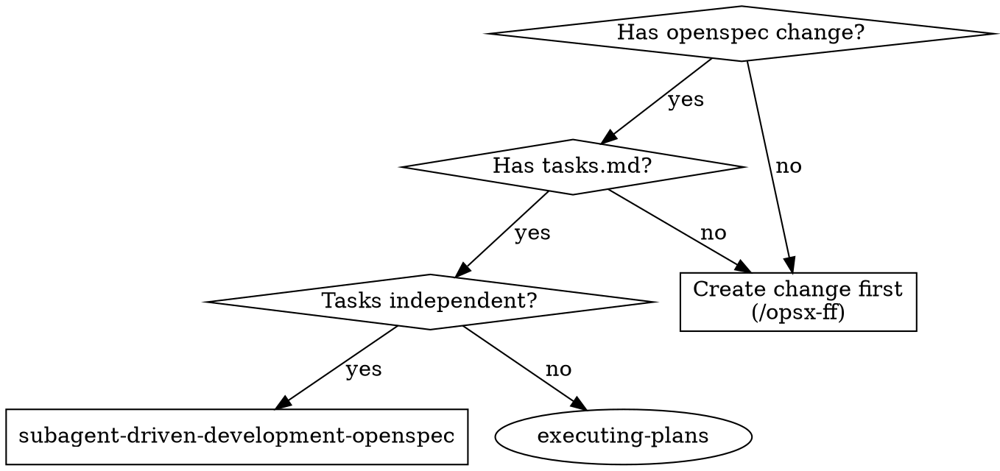
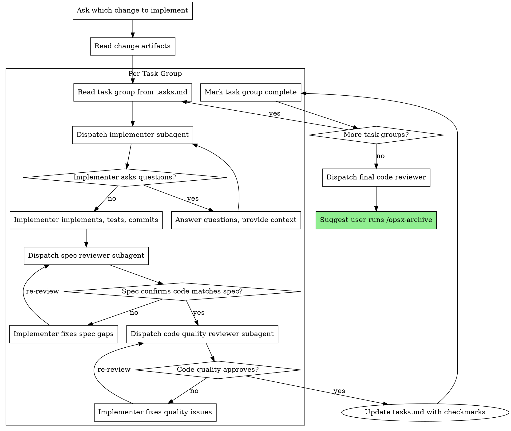

# Subagent-Driven Development (OpenSpec)

Execute an OpenSpec change by dispatching fresh subagent per task group, with two-stage review after each: spec compliance first, then code quality. Reads tasks from `openspec/changes/<name>/tasks.md`.

**Prerequisite:** [OpenSpec CLI](https://openspec.dev) installed and initialized. An OpenSpec change with a `tasks.md` file must exist in `openspec/changes/<name>/`.

**Why subagents:** You delegate tasks to specialized agents with isolated context. They should never inherit your session's context or history — you construct exactly what they need.

**Core principle:** Fresh subagent per task + two-stage review = high quality, fast iteration

## Before Starting

Ask the user which OpenSpec change to implement:

> "Which change do you want me to implement?"
>
> List available changes from `openspec/changes/` (exclude `archive/`).

Read the change's artifacts:
- `openspec/changes/<name>/tasks.md` — Tasks to implement
- `openspec/changes/<name>/proposal.md` — Why and what
- `openspec/changes/<name>/design.md` — Technical decisions
- `openspec/specs/<capability>/spec.md` — Canonical specs for modified capabilities
- `openspec/changes/<name>/specs/<capability>/spec.md` — Delta specs

## When to Use



## The Process



## Reading the tasks.md

OpenSpec `tasks.md` uses a task group structure:

```markdown
## 1. Component Name
- [ ] 1.1 Task description
- [ ] 1.2 Another task
```

Each **task group** (level-2 heading) is treated as one unit for subagent dispatch. Within a group, subtasks are individual steps.

**How to handle dependencies:**
- If task group 3 depends on task group 2, implement them in order
- If task groups are independent, implement sequentially but inform the user
- Each task group gets its own implementer subagent

## Task Group → Subagent Mapping

Each task group gets dispatched to an implementer subagent with:

- **Task group text** (full content of the section)
- **Context from proposal.md and design.md** (why and how)
- **Delta specs** (`openspec/changes/<name>/specs/`) for spec compliance review
- **Canonical specs** (`openspec/specs/`) for existing system behavior

After each task group, two-stage review:
1. **Spec compliance** — compare against delta + canonical specs
2. **Code quality** — using code-reviewer agent

After both reviews pass, **update tasks.md** to mark subtasks as complete:

```markdown
- [x] 1.1 Task description
- [x] 1.2 Another task
```

Edit the file directly (`openspec/changes/<name>/tasks.md`). This ensures `/opsx-archive` sees the correct completion status.

## Model Selection

Use the least powerful model that can handle each role to conserve cost:
- **Mechanical tasks** (isolated, 1-2 files): cheap model
- **Integration tasks** (multi-file, coordination): standard model
- **Review tasks**: most capable model

## Handling Implementer Status

Implementer subagents report one of four statuses:

**DONE:** Proceed to spec compliance review.

**DONE_WITH_CONCERNS:** The implementer doubts their work. Read concerns before reviewing.

**NEEDS_CONTEXT:** Provide missing context and re-dispatch.

**BLOCKED:** Assess the blocker, re-dispatch with a capable model, or escalate.

## Completion

After all task groups are implemented and reviewed:

1. **Dispatch final code reviewer** for the entire change
2. **Advise user to archive:**

> "All tasks implemented and reviewed. Run `/opsx-archive <change-name>` to finalize the change."
>
> Or if you prefer, I can verify delta specs are synced first with `/opsx-verify <change-name>`.

## Prompt Templates

Uses the same templates as subagent-driven-development:
- `./implementer-prompt.md` — Dispatch implementer subagent
- `./spec-reviewer-prompt.md` — Dispatch spec compliance reviewer
- `./code-quality-reviewer-prompt.md` — Dispatch code quality reviewer

## Integration

**Required tools:**
- **OpenSpec CLI** — Change must exist with tasks.md
- **superpowers:requesting-code-review** — Code review template
- **superpowers:test-driven-development** — Subagents follow TDD

**Workflow sequence:**
1. `brainstorming-openspec` → Design approval
2. User runs `/opsx-ff <name>` → Creates change artifacts
3. `subagent-driven-development-openspec` → Implements tasks
4. User runs `/opsx-archive <name>` → Archives change

## Red Flags

**Never:**
- Modify `openspec/specs/` directly — use `/opsx-sync` for spec updates
- Skip reviews (spec compliance OR code quality)
- Implement without reading the proposal/design context
- Ignore subagent questions
- Accept "close enough" on spec compliance
- Move to next task group with unresolved issues
- Archive the change yourself — let the user decide when to archive
- Start implementation on main/master without explicit user consent
